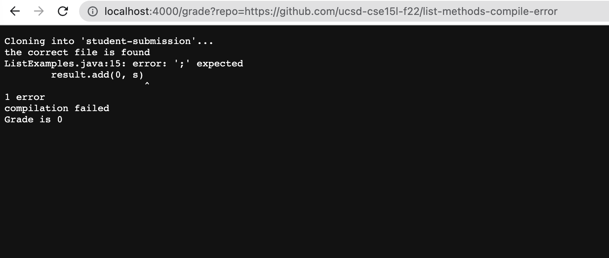
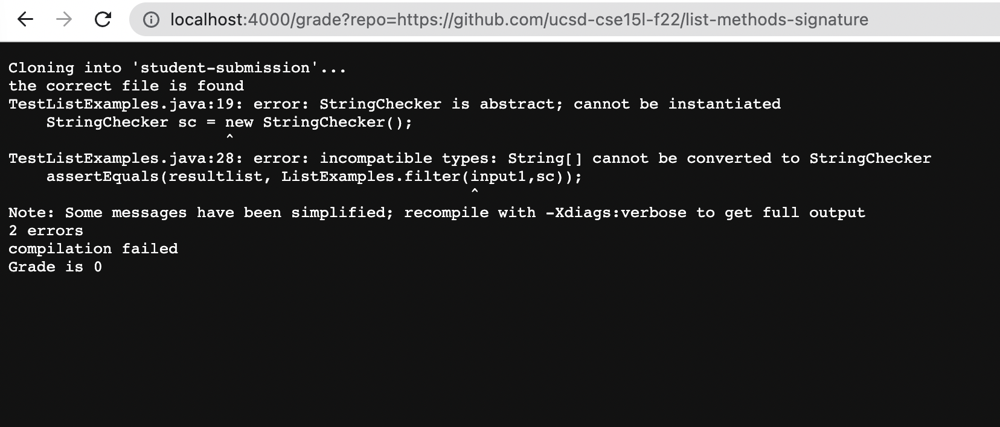
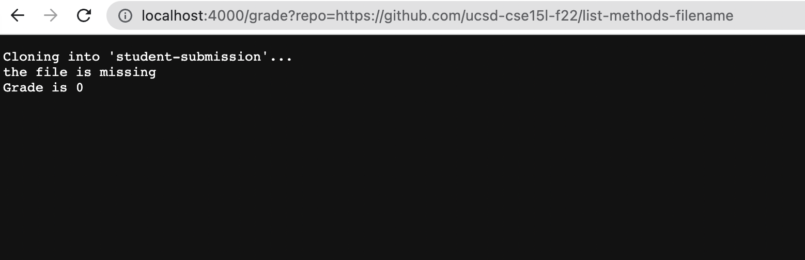

# Lab Report 5
### 11/28/22
### Gunju Kim


## code block of grade.sh
```
# Create your grading script here
# Clone the repository of the student submission to a well-known directory name
rm -rf student-submission
git clone $1 student-submission
GRADE="0"
cd student-submission
# Check that the student code has the correct file submitted.
if [ -f "ListExamples.java" ]
then 
    echo "the correct file is found"
else
    echo "the file is missing"
    echo "Grade is" $GRADE
    exit 1
fi
# Somehow get the student code and your test .java file into the same directory
mkdir testdir
cp -r ../lib testdir/
cp ../TestListExamples.java testdir/
cp ListExamples.java testdir/
cd testdir
javac -cp .:lib/hamcrest-core-1.3.jar:lib/junit-4.13.2.jar *.java

# If the compilation fails, detect and give helpful feedback about it.
if [ $? -eq 00 ]
then 
    echo "compilation succeeded"
else 
    echo "compilation failed"
    echo "Grade is" $GRADE
    exit 1
fi

if [ $? -eq 00 ]
then 
    GRADE=2
    echo "Grade is" $GRADE
else
    echo "Grade is" $GRADE
fi
```
> ###  Submission of repository with compile error
## 
> ###  Submission of repository with wrong order of filter arguments
## 
> ###  Submission of repository with wrong file name
## 
> ### 1. The original student submission file was removed. Then, the repository, https://github.com/ucsd-cse15l-f22/list-methods-filename , is cloned. The cloned repository is now the current directory. All of these were successfully processed with return code 0.
> ### 2. The condition was false for the first if statement because ListExamples.java doesn't exit. Therefore, "the file is missing" and "Grade is" $GRADE" are echoed. With exit code 1, early exit happens and all the other lines are not ran.
